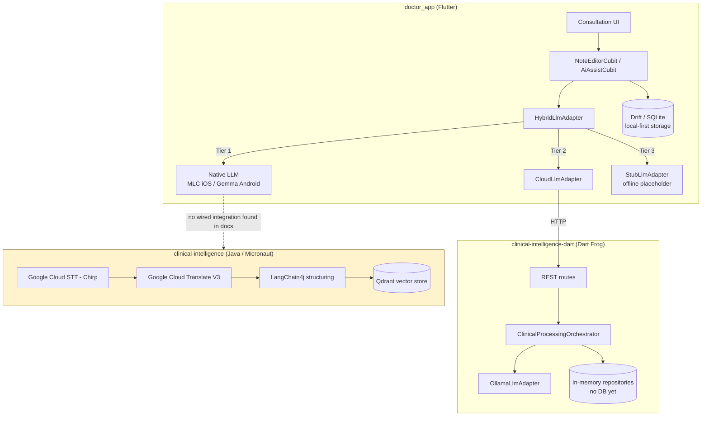
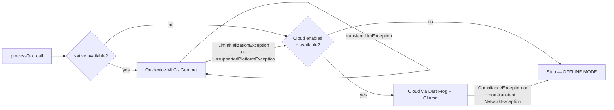

<div align="center">

# EdgeLLMHub

**A privacy-first clinical intelligence platform for on-device and hybrid LLM inference.**

*Doctors talk. The system listens, cleans, structures, and summarizes — without your patients' words leaving the device unless you explicitly allow it.*

[](#)
[](#)
[](#)
[](#)
[](#)
[](#license)

[Architecture](docs/architecture.md) · [Mobile](docs/mobile.md) · [Backend](docs/backend.md) · [Java Enterprise](docs/java-enterprise.md) · [Security](docs/security.md) · [Scalability](docs/scalability.md) · [Deployment](docs/deployment.md) · [Contributing](docs/developer-guide.md)

</div>

---

## Table of Contents

- [What is EdgeLLMHub](#what-is-edgellmhub)
- [Why it exists](#why-it-exists)
- [Problems it solves](#problems-it-solves)
- [Architecture at a glance](#architecture-at-a-glance)
- [The three systems](#the-three-systems)
- [Hybrid LLM routing](#hybrid-llm-routing)
- [Offline-first, privacy-first](#offline-first-privacy-first)
- [Security posture](#security-posture)
- [Scalability posture](#scalability-posture)
- [Repository structure](#repository-structure)
- [Installation](#installation)
- [Quick start](#quick-start)
- [Running locally](#running-locally)
- [Testing](#testing)
- [Documentation index](#documentation-index)
- [Roadmap](#roadmap)
- [Known limitations](#known-limitations)
- [Contributing](#contributing)
- [License](#license)
- [Acknowledgements](#acknowledgements)

---

## What is EdgeLLMHub

EdgeLLMHub (internally, the monorepo is also referred to as `dev-playground`) is a clinical intelligence platform built around one constraint that shapes every other decision in the codebase: **a patient's spoken words should default to never leaving the doctor's device.**

It is not a single application. It is three cooperating systems, each solving a different part of the problem:

| System | Language / Framework | Role |
|---|---|---|
| **`doctor_app`** | Flutter (Dart) | The doctor-facing mobile client — records, transcribes, cleans, and structures a consultation, on-device by default. |
| **`clinical-intelligence-dart`** | Dart Frog | A lightweight cloud fallback for the mobile app's LLM calls when on-device inference isn't available, backed by a local Ollama instance. |
| **`clinical-intelligence` (Java)** | Micronaut + LangChain4j + Qdrant | An enterprise-grade batch pipeline for transcription, translation, LLM-based clinical structuring, and semantic (vector) search over clinical artifacts. |

The first two are extensively documented, audited, and iterated on across this repository's architecture notes. The third is real and present in the monorepo, but at the time of writing it is **not referenced anywhere in the mobile/backend architecture documentation** — treat it as a parallel, independently-evolving system rather than something the doctor_app currently calls. See [Known limitations](#known-limitations).

## Why it exists

Clinical documentation is one of the highest-friction parts of a doctor's day. Every minute spent typing notes is a minute not spent with a patient. Existing "AI scribe" products largely solve this by streaming raw audio or transcripts to a cloud API — which, for a healthcare workload, means every vendor in that chain becomes part of your compliance surface.

EdgeLLMHub's founding bet is that **on-device inference has gotten good enough** (quantized 2–3B parameter models running on modern phone silicon) that a clinical scribe can default to local-only processing, and treat the cloud as an explicit, gated fallback rather than the default path.

## Problems it solves

- **PHI exposure risk** — on-device-first processing means protected health information doesn't need a network call to be useful.
- **Connectivity gaps** — hospital basements, rural clinics, and moving vehicles are all normal operating environments; the app is offline-first by design, not as an afterthought.
- **Vendor lock-in** — the LLM layer is a port/adapter abstraction (`LlmPort`), so the underlying model (MLC/Llama on iOS, Gemma on Android, Ollama-hosted models on the cloud fallback) can be swapped without touching application code.
- **Documentation burden** — structured 7-field clinical summaries (complaint, history, vitals, exam, investigations, diagnosis, advice) are generated directly from a cleaned transcript, not typed by hand.
- **Regional-language clinical data** — the Java enterprise pipeline exists specifically to bring non-English clinical audio into a searchable, structured, English-normalized form via Google Cloud Speech-to-Text (Chirp) and Translate V3.

## Architecture at a glance



> The dotted line above is deliberate: nothing in the current documentation set shows the mobile app or the Dart backend calling into the Java pipeline. They appear to be separate, independently-developed systems inside the same monorepo.

## The three systems

### `doctor_app` — the mobile client
Clean Architecture (presentation → domain → data) with BLoC/Cubit state management, Drift for local persistence, and a hybrid three-tier LLM adapter. Full detail in [`docs/mobile.md`](docs/mobile.md).

### `clinical-intelligence-dart` — the lightweight cloud fallback
Dart Frog server using Hexagonal Architecture (ports/adapters). Talks to a local Ollama instance for cloud-tier LLM calls. Currently has **no database, no authentication**, and holds all state in memory — this is the system's most-flagged set of gaps across every architecture review in this repo. Full detail in [`docs/backend.md`](docs/backend.md).

### `clinical-intelligence` (Java) — the enterprise batch pipeline
A Micronaut + LangChain4j service that ingests raw clinical audio/text, transcribes it (Google Cloud Speech-to-Text, Chirp model), translates it to English (Google Cloud Translate V3), structures it with an LLM (LangChain4j orchestration, embeddings via All-MiniLM-L6-v2), and indexes it in Qdrant for semantic search. Full detail in [`docs/java-enterprise.md`](docs/java-enterprise.md).

## Hybrid LLM routing

The mobile app's core reliability pattern is a three-tier fallback, implemented in `HybridLlmAdapter`:



The key design decision: **permanent** failures (wrong platform, model failed to initialize) disable a tier for the rest of the session; **transient** failures (one bad inference call) do not — the same tier is retried on the next request. This distinction is what stops a single hiccup from silently degrading every subsequent call to the stub.

## Offline-first, privacy-first

- **Local-first writes**: every note is written to Drift (SQLite) immediately; sync to the backend is a background concern, not a blocking one.
- **Debounced autosave/sync**: 2-second autosave debounce, 3-second sync debounce, to avoid saturating storage or network on every keystroke.
- **CAP-theorem stance**: the app deliberately chooses **availability and partition tolerance** over strict consistency — you can always write a note, online or offline; the backend's view of the world may be briefly stale.
- **Compliance gate**: cloud LLM usage is meant to be opt-in and fail-closed. (See [Security posture](#security-posture) for a currently-open gap here.)

## Security posture

The honest, current-state summary — full detail and fixes in [`docs/security.md`](docs/security.md):

| Severity | Issue | Status |
|---|---|---|
| 🔴 P0 | No authentication or authorization on any backend route | Open — any client can read any doctor's data by guessing an ID (OWASP API Top 10, BOLA) |
| 🔴 P0 | Cloud-LLM compliance gate can default to an unsafe value in debug builds | Open — one-line fix, high-severity if shipped |
| 🔴 P0 | In-memory backend persistence | Open — a restart deletes unsynced data |
| 🔴 P0 | In-memory mobile sync queue | Open — an OS-killed app forgets what still needs to sync |
| 🟠 P1 | Weak prompt-injection defense (no chat-roles boundary) | Open |
| 🟠 P1 | No local at-rest encryption (Drift/SQLite) | Open |
| 🟠 P1 | No rate limiting / per-doctor quotas | Open |

This is a system with **excellent security intent** (on-device-by-default PHI handling, explicit compliance gating, healthcare-safe prompts) and a **backend that has not yet earned production trust**. Don't point this at real patient data until the P0 list is clear.

## Scalability posture

The backend's growth path is staged around five explicit user-count tiers, each with a named bottleneck that has to be resolved before the next tier is reachable — see [`docs/scalability.md`](docs/scalability.md) for the full breakdown (in-memory persistence → Ollama concurrency → synchronous HTTP → single-region database → global sharding).

## Repository structure

```
EdgeLLMHub/  (aka dev-playground)
├── projects/
│   ├── apps/
│   │   ├── doctor_app/                  # Flutter mobile client
│   │   ├── clinical-intelligence-dart/  # Dart Frog backend (mobile fallback)
│   │   ├── clinical-intelligence/       # Java/Micronaut enterprise pipeline
│   │   └── app/                         # Java sandbox app
│   └── libs/
│       ├── utilities/                   # Shared Java helpers
│       └── list/                        # Shared Java data structures
├── buildSrc/, gradle/                   # Gradle multi-project build tooling
├── .github/workflows/                   # CI
├── docs/                                # This documentation suite
└── diagrams/                            # Standalone Mermaid sources
```

## Installation

### Prerequisites

- **Flutter SDK** (for `doctor_app`) with iOS/Android toolchains as needed
- **Dart SDK** (bundled with Flutter; also used standalone for `clinical-intelligence-dart`)
- **JDK 17+** and the **Gradle wrapper** (for the Java services)
- **Docker & Docker Compose** (for local Qdrant)
- **Ollama**, running locally, for the Dart backend's cloud-tier LLM calls
- **Google Cloud service account credentials** (Speech-to-Text V2 / Translate V3), for the Java pipeline
- An **OpenAI API key** (or equivalent), for LangChain4j LLM calls in the Java pipeline
- A **physical iOS device (A15+, 6GB+ RAM)** to exercise on-device MLC inference — the simulator cannot run it

### Quick start

```bash
git clone https://github.com/RADICAL-devp/EdgeLLMHub.git
cd EdgeLLMHub
```

**Java enterprise pipeline:**
```bash
cd projects/apps/clinical-intelligence
docker-compose up -d          # starts local Qdrant
cd ../../../
./gradlew :clinical-intelligence:run
```

**Dart Frog backend:**
```bash
cd projects/apps/clinical-intelligence-dart
dart pub get
dart_frog dev                 # serves on http://127.0.0.1:8080
```

**Ollama (required by the Dart backend's cloud tier):**
```bash
ollama serve                  # expected on http://127.0.0.1:11435 per adapter config
ollama pull llama3.2
```

**Mobile app:**
```bash
cd projects/apps/doctor_app
flutter pub get
flutter run                   # point EnvironmentConfig.apiBaseUrl at your backend
```

> On a physical device, `localhost` will not resolve to your dev machine — set `apiBaseUrl` to your machine's LAN IP.

### Running locally

For full-stack local development you'll typically want, in order: Qdrant (Docker) → Java pipeline (Gradle) and/or Ollama + Dart Frog backend → Flutter app pointed at whichever backend you're exercising. The mobile app can run entirely offline against on-device inference with no backend at all.

## Testing

```bash
# Mobile (doctor_app)
cd projects/apps/doctor_app && flutter test

# Java monorepo-wide
./gradlew test

# Java, single module
./gradlew :clinical-intelligence:test
```

Current state: the mobile app has 53 passing unit tests covering exception hierarchy, LLM adapters, circuit breaker, and input validation. The Java pipeline uses JUnit 5 + Mockito. **There is no integration test suite spanning mobile ↔ Dart backend**, and none spanning either of those and the Java pipeline.

## Documentation index

| Document | Covers |
|---|---|
| [`docs/architecture.md`](docs/architecture.md) | Vision, drivers, system context, full architecture, ADR summary |
| [`docs/mobile.md`](docs/mobile.md) | Flutter app internals, native bridges, DI, testing |
| [`docs/backend.md`](docs/backend.md) | Dart Frog backend internals, ports/adapters, error handling |
| [`docs/java-enterprise.md`](docs/java-enterprise.md) | Micronaut pipeline, LangChain4j, Qdrant, Google Cloud AI |
| [`docs/security.md`](docs/security.md) | Threat model, PHI handling, compliance gate, roadmap |
| [`docs/scalability.md`](docs/scalability.md) | Growth from 10 to 100M users, tier by tier |
| [`docs/deployment.md`](docs/deployment.md) | Local dev, Docker, CI/CD, production deployment |
| [`docs/developer-guide.md`](docs/developer-guide.md) | Contributing, code style, how to add a feature |

## Roadmap

**Now** — auth/authz on every backend route · fail-closed compliance gate · Postgres migration · durable sync queue
**Next** — shared Dart package for duplicated contracts · chat-roles Ollama endpoint · token/context budgeting · rate limiting · local at-rest encryption
**Later** — vLLM-backed serving · async/queue-based processing · database sharding · clarify and wire (or formally separate) the Java enterprise pipeline's relationship to the mobile/Dart systems

Full detail in [`docs/architecture.md`](docs/architecture.md#future-architecture).

## Known limitations

- The Java `clinical-intelligence` pipeline's integration with the rest of the platform is **undocumented** — this README describes it as a parallel system because no source material shows otherwise. Treat `docs/java-enterprise.md` as describing that service in isolation.
- The Dart backend is **not production-ready**: no auth, no persistent database, no rate limiting.
- iOS on-device inference requires a physical A15+ device; the simulator cannot exercise it, and speech-to-text also fails silently on the simulator.
- No end-to-end integration tests exist across any of the three systems.

## Contributing

See [`docs/developer-guide.md`](docs/developer-guide.md) for code style, branching strategy, PR expectations, and the review checklist.

## License

*License to be determined — no LICENSE file is currently present in the repository. Do not treat this project as open for reuse until one is added.*

## Acknowledgements

Built on Flutter, Dart Frog, Micronaut, LangChain4j, Qdrant, Ollama, MLC LLM, and Google Cloud AI.
