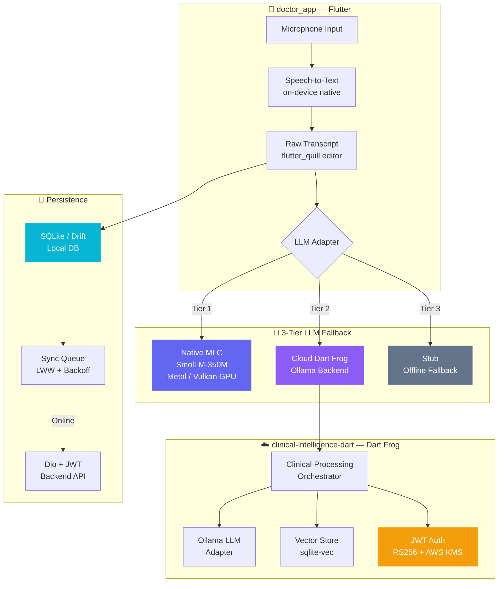
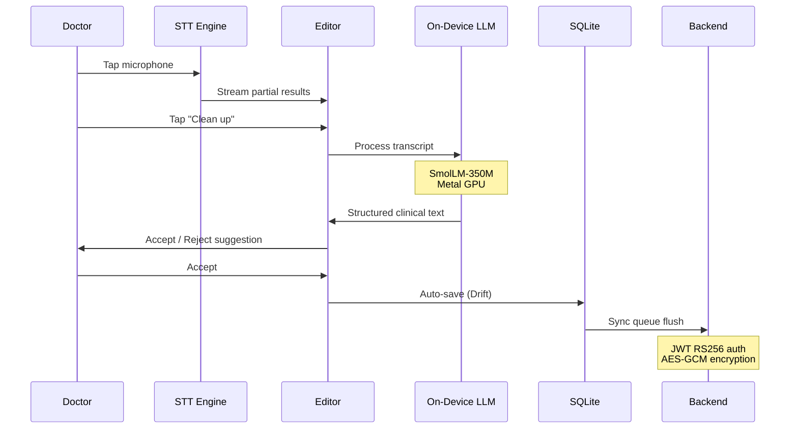
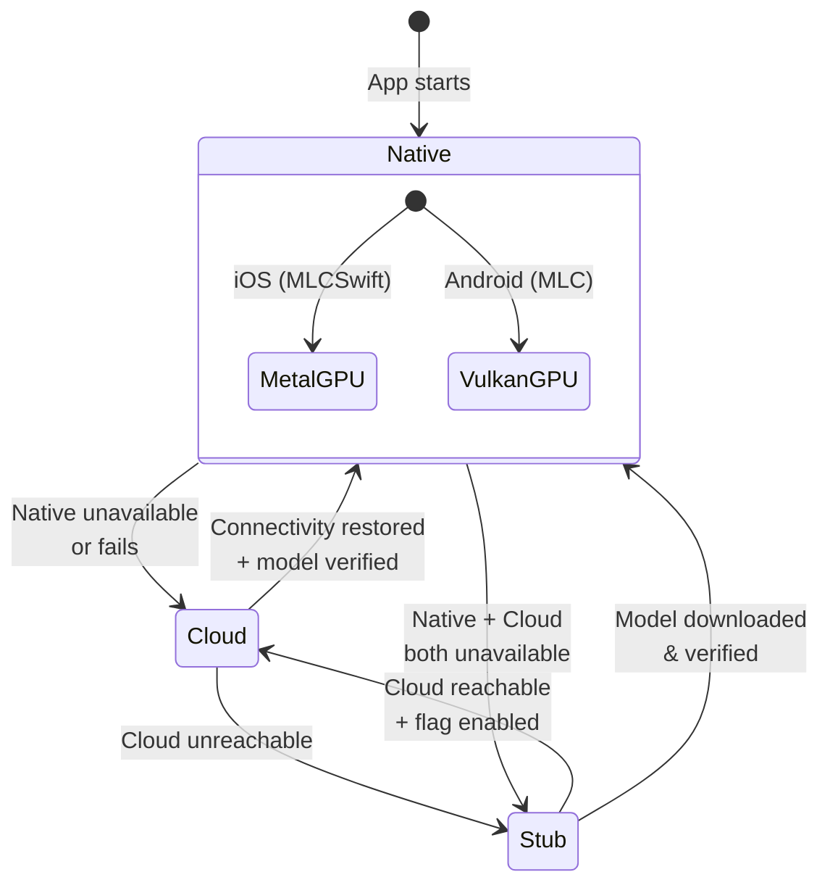
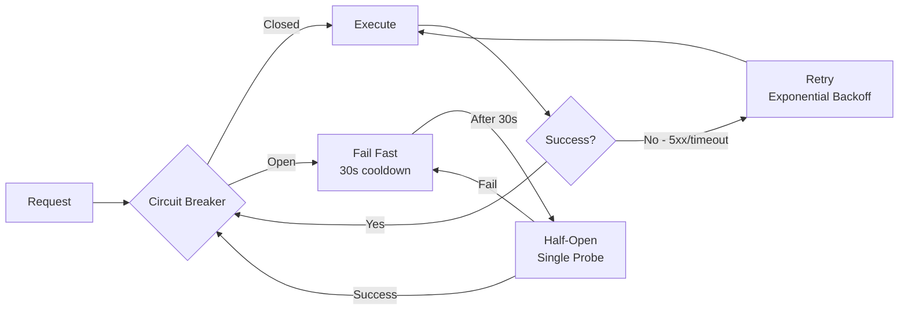

<div align="center">

<!-- ──────────────────────────────────────────────────────────── -->
<!--  Animated SVG Header                                         -->
<!-- ──────────────────────────────────────────────────────────── -->
<svg width="720" height="200" viewBox="0 0 720 200" xmlns="http://www.w3.org/2000/svg">
  <defs>
    <linearGradient id="g" x1="0%" y1="0%" x2="100%" y2="100%">
      <stop offset="0%"   stop-color="#6366f1"/>
      <stop offset="50%"  stop-color="#8b5cf6"/>
      <stop offset="100%" stop-color="#06b6d4"/>
    </linearGradient>
    <filter id="glow">
      <feGaussianBlur stdDeviation="3" result="blur"/>
      <feMerge><feMergeNode in="blur"/><feMergeNode in="SourceGraphic"/></feMerge>
    </filter>
  </defs>
  <rect width="720" height="200" rx="16" fill="#0f172a"/>
  <!-- animated circuit lines -->
  <g stroke="#1e293b" stroke-width="1.5" fill="none" opacity="0.6">
    <path d="M0,60 Q180,30 360,60 T720,60"/>
    <path d="M0,100 Q180,70 360,100 T720,100"/>
    <path d="M0,140 Q180,110 360,140 T720,140"/>
  </g>
  <!-- pulsing nodes -->
  <circle cx="120" cy="60" r="4" fill="#6366f1" opacity="0.8">
    <animate attributeName="r" values="3;6;3" dur="2s" repeatCount="indefinite"/>
    <animate attributeName="opacity" values="0.5;1;0.5" dur="2s" repeatCount="indefinite"/>
  </circle>
  <circle cx="360" cy="100" r="4" fill="#8b5cf6" opacity="0.8">
    <animate attributeName="r" values="3;6;3" dur="2.5s" repeatCount="indefinite"/>
    <animate attributeName="opacity" values="0.5;1;0.5" dur="2.5s" repeatCount="indefinite"/>
  </circle>
  <circle cx="600" cy="140" r="4" fill="#06b6d4" opacity="0.8">
    <animate attributeName="r" values="3;6;3" dur="3s" repeatCount="indefinite"/>
    <animate attributeName="opacity" values="0.5;1;0.5" dur="3s" repeatCount="indefinite"/>
  </circle>
  <!-- title -->
  <text x="360" y="90" text-anchor="middle" font-family="system-ui, -apple-system, sans-serif" font-size="42" font-weight="800" fill="url(#g)" filter="url(#glow)">
    EdgeLLMHub
  </text>
  <!-- subtitle -->
  <text x="360" y="120" text-anchor="middle" font-family="system-ui, -apple-system, sans-serif" font-size="16" fill="#94a3b8" letter-spacing="3">
    ON-DEVICE AI FOR CLINICAL DOCUMENTATION
  </text>
  <!-- tagline -->
  <text x="360" y="155" text-anchor="middle" font-family="system-ui, -apple-system, sans-serif" font-size="12" fill="#64748b">
    Your data never leaves the device.
  </text>
</svg>

<!-- ──────────────────────────────────────────────────────────── -->
<!--  Badges                                                     -->
<!-- ──────────────────────────────────────────────────────────── -->
<br/>


</div>

<br/>

---

## Overview

**EdgeLLMHub** is a multi-platform clinical AI system that transforms dictation into structured clinical notes — entirely on-device. A doctor speaks, the app transcribes, and on-device AI enriches the raw transcript into clinical notes. **PHI never leaves the device.**

<div align="center">

| 🧠 | 🎙️ | 🔒 | 📱 |
|:---:|:---:|:---:|:---:|
| **On-Device LLM** | **Speech-to-Text** | **PHI Encryption** | **Offline-First** |
| SmolLM-350M via | Native on-device | AES-256-GCM | LWW conflict |
| MLC runtime | STT (iOS/Android) | field-level at rest | resolution + sync |

</div>

---

## Architecture

### System Overview


```mermaid
graph TD
    subgraph Mobile["📱 doctor_app — Flutter"]
        A[Microphone Input] --> B[Speech-to-Text<br/>on-device native]
        B --> C[Raw Transcript<br/>flutter_quill editor]
        C --> D{LLM Adapter}
    end

    subgraph LLM["🧠 3-Tier LLM Fallback"]
        D -->|Tier 1| E[Native MLC<br/>SmolLM-350M<br/>Metal / Vulkan GPU]
        D -->|Tier 2| F[Cloud Dart Frog<br/>Ollama Backend]
        D -->|Tier 3| G[Stub<br/>Offline Fallback]
    end

    subgraph Backend["☁️ clinical-intelligence-dart — Dart Frog"]
        F --> H[Clinical Processing<br/>Orchestrator]
        H --> I[Ollama LLM<br/>Adapter]
        H --> J[Vector Store<br/>sqlite-vec]
        H --> K[JWT Auth<br/>RS256 + AWS KMS]
    end

    subgraph Storage["💾 Persistence"]
        C --> L[SQLite / Drift<br/>Local DB]
        L --> M[Sync Queue<br/>LWW + Backoff]
        M -->|Online| N[Dio + JWT<br/>Backend API]
    end

    style E fill:#6366f1,stroke:#6366f1,color:#fff
    style F fill:#8b5cf6,stroke:#8b5cf6,color:#fff
    style G fill:#64748b,stroke:#64748b,color:#fff
    style L fill:#06b6d4,stroke:#06b6d4,color:#fff
    style K fill:#f59e0b,stroke:#f59e0b,color:#fff
```

### Data Flow — Dictation to Clinical Note


```mermaid
sequenceDiagram
    participant 👨‍⚕️ as Doctor
    participant 🎙️ as STT Engine
    participant 📝 as Editor
    participant 🧠 as On-Device LLM
    participant 💾 as SQLite
    participant ☁️ as Backend

    👨‍⚕️->>🎙️: Tap microphone
    🎙️->>📝: Stream partial results
    👨‍⚕️->>📝: Tap "Clean up"
    📝->>🧠: Process transcript
    Note over 🧠: SmolLM-350M<br/>Metal GPU
    🧠->>📝: Structured clinical text
    📝->>👨‍⚕️: Accept / Reject suggestion
    👨‍⚕️->>📝: Accept
    📝->>💾: Auto-save (Drift)
    💾->>☁️: Sync queue flush
    Note over ☁️: JWT RS256 auth<br/>AES-GCM encryption
```

### LLM Fallback Chain


```mermaid
stateDiagram-v2
    [*] --> Native: App starts
    Native --> Cloud: Native unavailable<br/>or fails
    Native --> Stub: Native + Cloud<br/>both unavailable
    Cloud --> Native: Connectivity restored<br/>+ model verified
    Cloud --> Stub: Cloud unreachable
    Stub --> Native: Model downloaded<br/>& verified
    Stub --> Cloud: Cloud reachable<br/>+ flag enabled

    state Native {
        [*] --> MetalGPU: iOS (MLCSwift)
        [*] --> VulkanGPU: Android (MLC)
    }
```

---

## Tech Stack

| Layer | Technology | Purpose |
|-------|-----------|---------|
| **Framework** | Flutter 3.5+ / Dart 3.12 | Cross-platform mobile UI |
| **State** | BLoC / Cubit | Predictable state management |
| **Persistence** | Drift (SQLite) | Offline-first local database |
| **On-Device LLM** | MLC-LLM + SmolLM-350M | PHI-preserving AI inference |
| **Speech-to-Text** | Native (Speech.framework / RecognizerIntent) | On-device transcription |
| **HTTP** | Dio + retry interceptor | Resilient network calls |
| **Auth** | JWT RS256 + AWS KMS | Production-grade signing |
| **Encryption** | AES-256-GCM + ChaCha20 | Field-level PHI encryption |
| **Backend** | Dart Frog (Dart) + Micronaut (Java) | Clinical processing APIs |
| **Vector Store** | sqlite-vec | Context-enriched retrieval |
| **Background** | Workmanager | Offline sync scheduling |

---

## Project Structure

```
dev-playground/
├── projects/
│   ├── apps/
│   │   ├── doctor_app/              # 📱 Flutter mobile app (primary)
│   │   │   ├── lib/
│   │   │   │   ├── core/            # DI, auth, LLM, crypto, network, observability
│   │   │   │   └── features/
│   │   │   │       └── note_assist/ # Domain / data / presentation layers
│   │   │   └── ios/                 # MLC-LLM Swift integration + Metal runtime
│   │   │
│   │   ├── clinical-intelligence-dart/  # ☁️ Dart Frog backend
│   │   │   ├── lib/
│   │   │   │   ├── application/     # Ports & services (hexagonal architecture)
│   │   │   │   ├── core/            # Auth, crypto, observability, validation
│   │   │   │   └── infrastructure/  # LLM adapters, persistence, embeddings
│   │   │   └── routes/              # API routes (clinical processing, summarization)
│   │   │
│   │   └── clinical-intelligence/   # ☕ Java/Micronaut backend (legacy)
│   │       └── src/main/java/       # LLM service, speech, translation
│   │
│   └── packages/
│       └── shared_models/           # 📦 Shared Dart DTOs
│
├── .github/workflows/               # CI/CD (4 workflows)
└── .opencode/plans/                 # Implementation specs
```

---

## Key Features

### 🧠 On-Device LLM Inference

3-tier fallback with compliance gating — PHI never leaves the device for AI processing.

| Tier | Implementation | Model | When |
|------|---------------|-------|------|
| **Native** | MLCSwift (iOS/Metal) or MLC (Android/Vulkan) | SmolLM-350M-Instruct-q4f16_1 | Default — always attempted first |
| **Cloud** | Dart Frog → Ollama adapter | Configurable | Gated by `cloudLlmEnabled` flag |
| **Stub** | Regex-based offline processing | N/A | Fallback when both above fail |

- Model integrity: SHA-256 checksum verification + constant-time comparison
- MethodChannel bridge with formal Dart↔Swift/Kotlin contract
- Token streaming with cancellation support

### 🎙️ Speech-to-Text

Platform-aware factory pattern with medical post-processing:

- **iOS**: `Speech.framework` adapter with VAD auto-stop
- **Android**: `RecognizerIntent` adapter
- **Medical**: Abbreviation expansion, BP/HR/RR formatting, temperature normalization
- **Simulator**: Cloud mock (no real audio transmitted)

### 🔒 Security & Compliance

- **AES-256-GCM** field-level encryption for PHI fields (patientId, doctorId, rawText, richTextDelta)
- **PBKDF2** key derivation (100k iterations per field DEK)
- **JWT RS256** authentication with AWS KMS-backed signing
- **Consent audit trail** — every PHI access logged with redacted metadata
- **STRIDE threat model** + comprehensive HIPAA/GDPR checklist

### 📱 Offline-First Sync

```
Local DB (Drift/SQLite) → Sync Queue → Backend API
     ↓                      ↓
 LWW Conflict          Exponential Backoff
 Resolution            + Jitter + Dead-Letter
```

- Foreground timer (5 min) + connectivity-triggered flush
- Android WorkManager (15 min periodic)
- Manual merge UI for sync conflicts (side-by-side diff)

### 🛡️ Network Resilience


```mermaid
graph LR
    A[Request] --> B{Circuit Breaker}
    B -->|Closed| C[Execute]
    B -->|Open| D[Fail Fast<br/>30s cooldown]
    C --> E{Success?}
    E -->|Yes| B
    E -->|No - 5xx/timeout| F[Retry<br/>Exponential Backoff]
    F --> C
    D -->|After 30s| G[Half-Open<br/>Single Probe]
    G -->|Success| B
    G -->|Fail| D
```

---

## Getting Started

### Prerequisites

| Tool | Version | Purpose |
|------|---------|---------|
| Xcode | 16+ | iOS builds |
| Flutter | 3.5+ | Mobile framework |
| Java | 17+ | Backend builds |
| Ollama | Latest | Local LLM (optional) |

### Quick Start

```bash
# 1. Clone
git clone https://github.com/RADICAL-devp/EdgeLLMHub.git
cd EdgeLLMHub

# 2. Setup Flutter app
cd projects/apps/doctor_app
flutter pub get
cd ios && pod install && cd ..

# 3. Run on iOS device (required for on-device LLM)
flutter run --release

# 4. Setup Dart Frog backend (optional)
cd ../clinical-intelligence-dart
dart pub get
dart_frog dev
```

> **Note:** On-device LLM requires a physical iOS device (A15+ chip) with Metal GPU support. Simulator runs in stub mode.

---

## API Reference

### Clinical Processing

| Endpoint | Method | Description |
|----------|--------|-------------|
| `/api/v1/clinical-processing/process` | POST | Process transcript with clinical AI |
| `/api/v1/transcript-summary/generate` | POST | Generate structured summary |
| `/api/v1/transcript-summary/{id}` | GET | Retrieve stored summary |
| `/api/v1/transcript-summary/{id}/regenerate` | POST | Regenerate with new parameters |
| `/metrics` | GET | Prometheus metrics |
| `/` | GET | Health check |

### Authentication

All clinical endpoints require JWT Bearer token:

```
Authorization: Bearer <jwt_token>
```

Tokens signed with RS256 (AWS KMS in production, local key in development).

---

## Testing

```bash
# Flutter app (482+ tests, >80% coverage)
cd projects/apps/doctor_app
flutter test --coverage
genhtml coverage/lcov.info -o coverage/html   # View HTML report

# Dart Frog backend (150+ tests)
cd projects/apps/clinical-intelligence-dart
dart test --coverage=coverage

# Java backend
cd projects/apps/clinical-intelligence
./gradlew test
```

| Component | Tests | Coverage |
|-----------|-------|----------|
| Cubits / BLoC | 120+ | **93%** |
| Core Services | 85+ | **88.5%** |
| LLM Adapters | 65+ | **88.4%** |
| Data / Repos | 90+ | **84.4%** |
| Domain | 45+ | **85.6%** |

---

## CI/CD

| Workflow | Trigger | Actions |
|----------|---------|---------|
| **Backend CI** | PR to main, push to main | Analyze → Test → Build |
| **Frontend CI** | PR to main, push to main | Analyze → Test → Coverage Gate |
| **iOS Model Prep** | Tag `model-*`, manual | Compile model for iOS |
| **Release** | Tag `v*` | Multi-platform build + GPG signing |

---

## Security & Compliance

<div align="center">


</div>

- **PHI never leaves the device** for AI processing — all LLM inference runs on-device via MLC runtime
- **Field-level encryption** with AES-256-GCM and per-field DEKs (PBKDF2, 100k iterations)
- **Consent audit trail** — every PHI access logged with redacted metadata
- **Full STRIDE threat model** documented in `docs/threat_model.md`
- **Input validation** with prompt injection defense and false-positive prevention

---

## Contributing

1. Create a feature branch from `main`
2. Follow existing code conventions (see `analysis_options.yaml`)
3. Write tests for new features — maintain >80% coverage
4. Run `flutter analyze` and `dart test` before committing
5. Submit PR with descriptive title and linked issue

---

<div align="center">

**Built with care for clinical workflows.**

*Your data stays yours.*

<br/>


</div>
