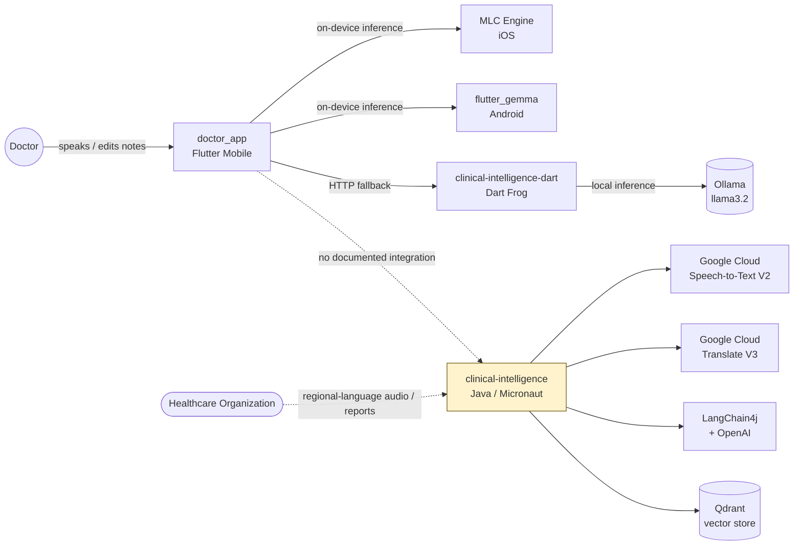
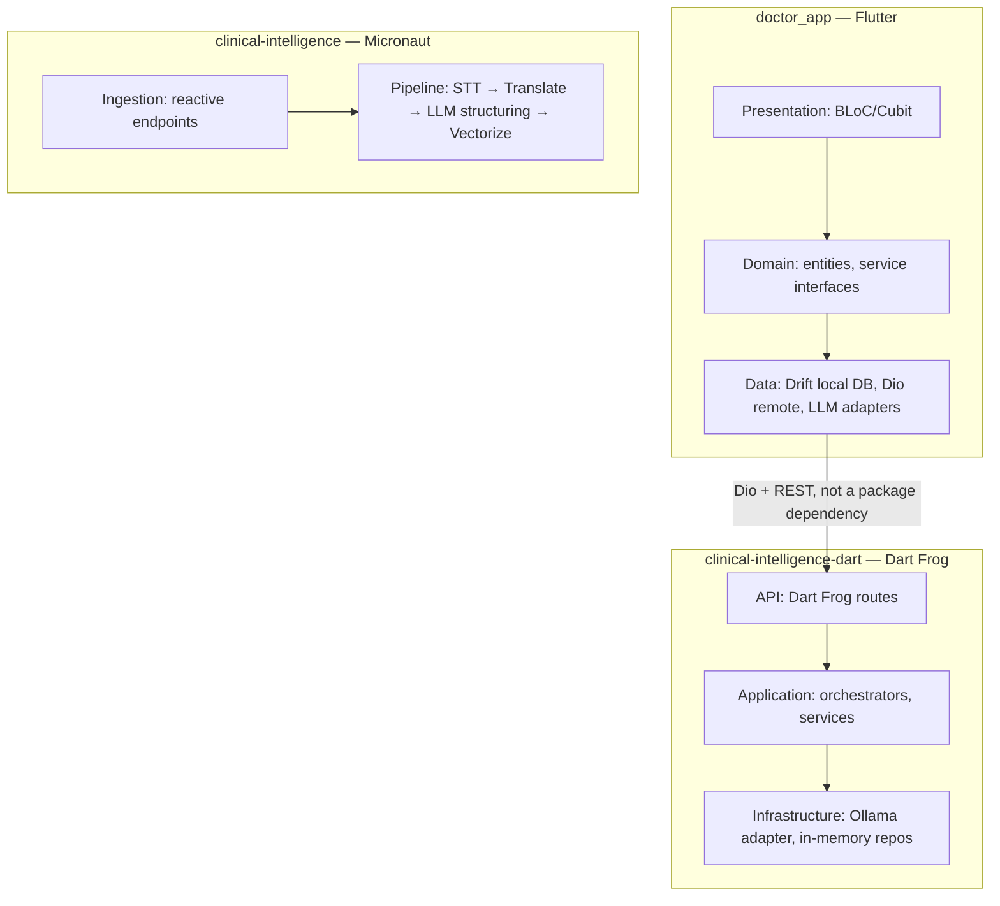
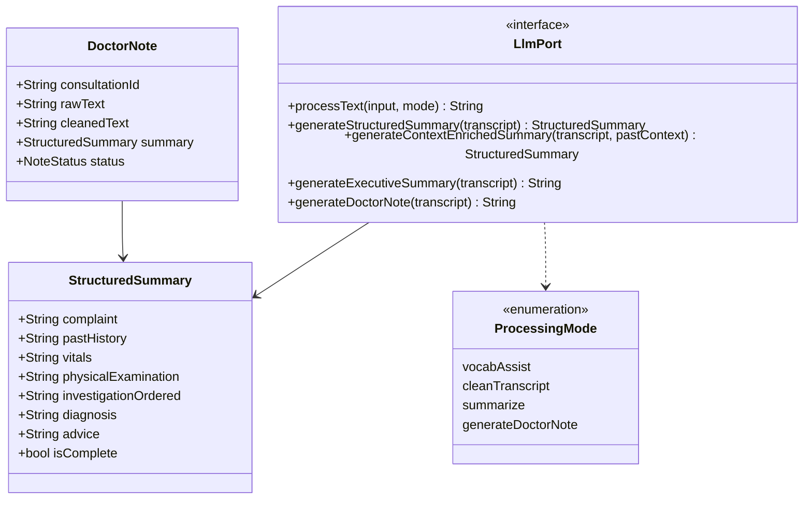
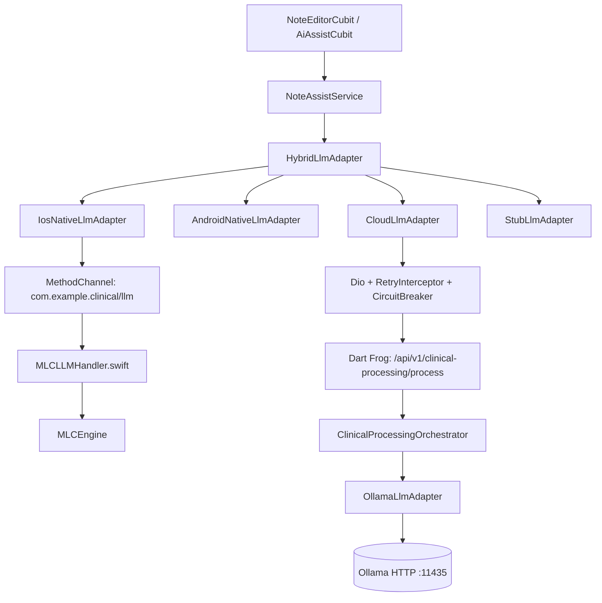
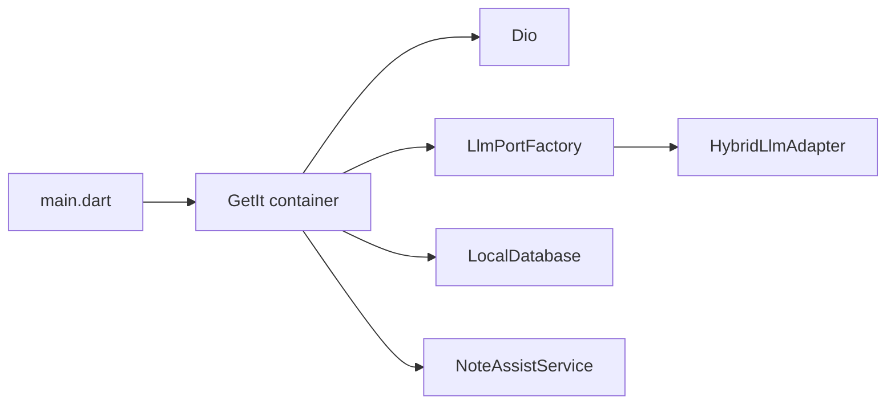
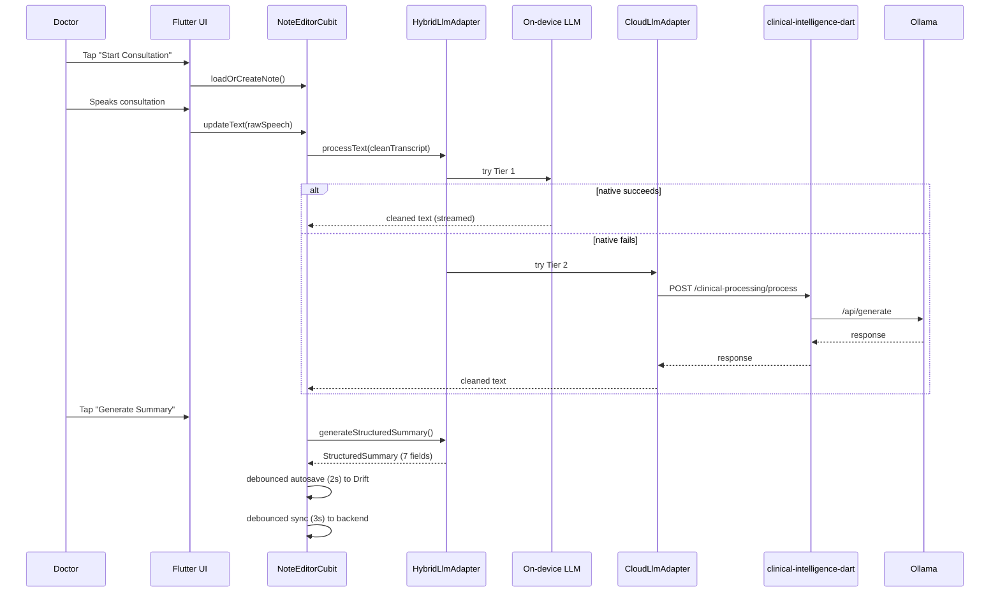
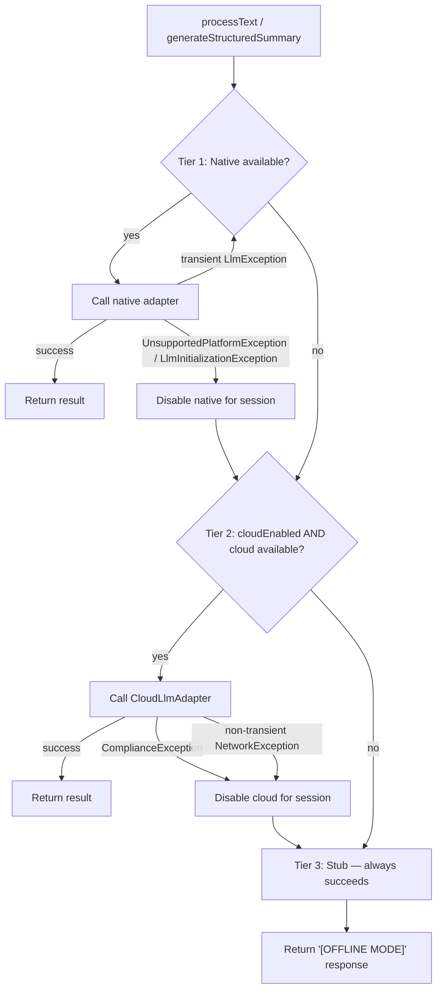

# Architecture

This document is the definitive architectural reference for EdgeLLMHub. It covers the vision behind the system, the drivers that shaped its design, the architecture as it exists today across all three subsystems, the alternatives that were seriously considered and rejected, and the direction the system is headed.

Every design decision recorded here explains **why**, not just **what** — architecture without rationale is just a diagram someone will eventually violate by accident.

---

## Table of Contents

- [Vision](#vision)
- [Goals](#goals)
- [Requirements](#requirements)
- [Constraints](#constraints)
- [Architecture Drivers](#architecture-drivers)
- [System Context](#system-context)
- [High-Level Architecture](#high-level-architecture)
- [Low-Level Architecture](#low-level-architecture)
- [Domain Model](#domain-model)
- [Component Diagram](#component-diagram)
- [Dependency Graph](#dependency-graph)
- [Layered Architecture](#layered-architecture)
- [Clean Architecture](#clean-architecture)
- [Hexagonal Architecture](#hexagonal-architecture)
- [Feature-First Architecture](#feature-first-architecture)
- [Data Flow](#data-flow)
- [LLM Flow](#llm-flow)
- [Design Decisions](#design-decisions)
- [Tradeoffs](#tradeoffs)
- [Alternatives Considered](#alternatives-considered)
- [Future Architecture](#future-architecture)
- [Architecture Decision Records — Summary](#architecture-decision-records--summary)

---

## Vision

A clinician should be able to record a consultation, walk away with a structured clinical note, and never have to think about where their patient's words went — because by default, they didn't go anywhere. EdgeLLMHub's long-term vision is a clinical intelligence layer that is **on-device by default, cloud by explicit consent, and structured/searchable at the organizational level** when a practice chooses to opt into the enterprise pipeline.

## Goals

- Minimize the surface area over which PHI (protected health information) ever leaves a clinician's device.
- Function correctly with no network connectivity at all — offline is a first-class mode, not a degraded one.
- Keep the LLM layer swappable: no application code should know or care whether a summary came from an on-device Llama model, a cloud-hosted Ollama model, or a stub.
- Give a doctor a structured, editable clinical note (complaint, history, vitals, exam, investigations, diagnosis, advice) with minimal typing.
- Allow an organization that wants centralized, searchable clinical records (across regional languages) to opt into the enterprise pipeline without changing how the mobile app behaves for doctors who don't.

## Requirements

### Functional
- Record and transcribe a consultation (on-device or cloud speech-to-text).
- Clean a raw transcript into readable clinical text.
- Generate a structured 7-field clinical summary from a transcript.
- Generate a free-text doctor's note and an executive summary.
- Persist notes locally and sync them to a backend when connectivity allows.
- (Enterprise pipeline) Transcribe regional-language clinical audio, translate to English, structure it, and index it for semantic search.

### Non-Functional
- **Availability over strict consistency** for the mobile write path (see [Design Decisions](#design-decisions)).
- **Low temperature, conservative LLM generation** for clinical safety (0.1 temperature on the Ollama adapter).
- **Sub-second UI responsiveness** during streaming generation (BLoC/Cubit rebuilding only the affected widget subtree).
- **Graceful degradation**: a failure at any single tier of the LLM stack must not be a user-visible crash.

## Constraints

- **No native GPU access on iOS Simulator or most Android emulators** — on-device LLM and native speech-to-text simply do not run there; the architecture must detect this and reroute rather than fail.
- **Two mobile platforms, two native LLM runtimes** — MLC LLM (Metal, iOS) and `flutter_gemma` (LiteRT-LM, Android) are structurally different integrations, not a single cross-platform API.
- **Small team, single primary language (Dart)** across the mobile app and its immediate backend — this shaped the backend language choice (see [Alternatives Considered](#alternatives-considered)).
- **Healthcare domain** — data residency and vendor lock-in carry more weight here than in a typical consumer app, which rules out some otherwise-attractive infrastructure simplifications.

## Architecture Drivers

| Driver | Implication |
|---|---|
| PHI must default to on-device | Three-tier LLM adapter with cloud as an explicit, gated fallback |
| Hospitals have unreliable connectivity | Offline-first mobile data layer (Drift), durable sync queue (partially implemented — see [`security.md`](security.md)) |
| iOS and Android have no common on-device LLM runtime | Platform-specific native adapters behind a shared `LlmPort` interface |
| Clinical accuracy matters more than fluency | Low-temperature generation, "do not invent" prompt constraints, no RAG-over-open-internet |
| A pilot deployment is one hospital department, not a hyperscale system | Synchronous REST, in-process orchestration — deliberately not queue/worker based yet |

---

## System Context



Two actors interact with the platform: the **doctor**, through the mobile app, and (per the Java pipeline's own documentation) an **organization-level ingestion process** feeding it clinical artifacts directly. Nothing in the source architecture material connects these two paths today — see [Future Architecture](#future-architecture).

---

## High-Level Architecture



The defining structural decision across the whole platform: **these are three independently deployable systems communicating over HTTP, not a single application with shared package dependencies.** Two of them (`doctor_app`, `clinical-intelligence-dart`) share *identical, hand-copied* data contracts to preserve interoperability without a formal package boundary — a decision examined in detail in [Design Decisions](#design-decisions).

---

## Low-Level Architecture

### `doctor_app`

```
lib/
├── core/
│   ├── llm/                # LlmPort implementations + HybridLlmAdapter
│   ├── ports/               # LlmPort, TranscriptRepository interfaces
│   ├── application_services/ # ClinicalProcessingOrchestrator, chunking, etc.
│   ├── models/               # StructuredSummary, ProcessingMode
│   ├── network/               # RetryInterceptor, CircuitBreaker, DioErrorHandler
│   ├── exceptions/            # Unified AppException hierarchy
│   └── config/                 # EnvironmentConfig, DI wiring
└── features/note_assist/
    ├── presentation/  # Cubits, pages, widgets
    ├── domain/         # NoteAssistService interface, DoctorNote entity
    └── data/            # Local (Drift) + remote (Dio) + sync repositories
```

### `clinical-intelligence-dart`

```
lib/
├── api/dto/            # Request/response DTOs
├── application/
│   ├── ports/           # LlmPort (same contract as doctor_app)
│   └── services/          # Orchestrators, summary/note generation services
├── core/models/            # StructuredSummary, ProcessingMode (duplicated from doctor_app)
└── infrastructure/
    └── llm/                  # OllamaLlmAdapter, StubLlmAdapter
routes/
├── api/v1/clinical-processing/process.dart
└── api/v1/transcript-summary/[consultationId]/{index,regenerate}.dart
```

### `clinical-intelligence` (Java)

```
projects/apps/clinical-intelligence/
```
Documented at the pipeline-stage level (see [`java-enterprise.md`](java-enterprise.md)): reactive Micronaut endpoints, a four-phase pipeline (ingest/transcribe → translate → LLM-structure → vectorize), and Qdrant for persistence. File- and class-level structure is not available in the current documentation set.

---

## Domain Model

The core clinical domain model is defined **twice** — once per Dart repository, kept in sync by convention rather than by the type system:



`StructuredSummary.isComplete` is a cheap automatic completeness heuristic — all seven fields non-empty — and is explicitly **not** a clinical-accuracy check. A summary can be complete and still wrong; there is no gold-standard evaluation or clinician-in-the-loop scoring today.

---

## Component Diagram



---

## Dependency Graph

**Mobile (`doctor_app`)** uses **GetIt** as a service locator, registered centrally in `main.dart`. This is a deliberate simplicity-over-purity choice for a small team, with a known cost: all singletons are globally reachable and live for the app's lifetime, and there's no conditional binding by platform without hand-written `if` branches inside registration code (flagged as a weakness in the mobile audit — see [`mobile.md`](mobile.md)).

**Backend (`clinical-intelligence-dart`)** wires dependencies at the Dart Frog middleware level (`_middleware.dart`), following the ports-and-adapters pattern: routes depend on `LlmPort` and repository interfaces, never on concrete adapters directly.



---

## Layered Architecture

Both Dart systems follow the same three-layer shape, differing only in what sits at the bottom:

```
┌─────────────────────────────────────────┐
│           PRESENTATION LAYER              │  Flutter UI / Dart Frog routes
├─────────────────────────────────────────┤
│             DOMAIN LAYER                   │  Services, ports, models
├─────────────────────────────────────────┤
│              DATA LAYER                     │  Drift + Dio (mobile) / Ollama + in-memory (backend)
└─────────────────────────────────────────┘
```

Dependencies point inward: the data layer knows about the domain layer's interfaces; the domain layer does not know about Drift, Dio, or Ollama.

## Clean Architecture

`doctor_app` is explicitly layered as **presentation → domain → data**, each with its own directory under `lib/features/note_assist/`. The domain layer holds `NoteAssistService` (an abstract interface) and entities like `DoctorNote`; the data layer provides the concrete implementations. This is what makes it possible to swap `OnDeviceLlmService` for a `MockNoteAssistService` in tests without touching a single Cubit.

## Hexagonal Architecture

`clinical-intelligence-dart` is Ports and Adapters by name and by structure: `lib/application/ports/llm_port.dart` defines the contract; `lib/infrastructure/llm/{ollama_llm_adapter,stub_llm_adapter}.dart` provide the implementations. The application layer's orchestrators depend only on the port. This is *why* adding a new inference backend (say, a hosted API) is a new adapter file, not a change to `ClinicalProcessingOrchestrator`.

## Feature-First Architecture

`doctor_app` organizes by feature (`lib/features/note_assist/`) rather than by technical layer at the top level, with Clean Architecture layering happening *inside* each feature. This keeps everything related to note-taking — UI, state, domain, data — colocated, at the cost of some duplication if a second feature module is added later and needs the same LLM plumbing (currently mitigated by keeping LLM adapters in `lib/core/` rather than inside the feature).

---

## Data Flow

A single consultation, start to finish:



The write to local storage (Drift) always happens first and is never blocked on network state — this is the CAP-theorem tradeoff discussed in [Design Decisions](#design-decisions).

## LLM Flow



The routing matrix, concretely:

| Scenario | Native | Cloud enabled | Cloud available | Result |
|---|---|---|---|---|
| Physical iOS/Android | ✅ | ✅ | ✅ | Native (MLC / Gemma) |
| iOS Simulator / Android Emulator | ❌ | ✅ | ✅ | Cloud |
| No network | ✅ | any | any | Native |
| Cloud disabled | any | ❌ | any | Native → Stub |
| All tiers fail | any | any | any | Stub |

---

## Design Decisions

Each decision below states the driver behind it, not just the outcome.

**Decision: Three-tier hybrid LLM adapter (native → cloud → stub) instead of a single always-cloud call.**
Why: the founding privacy constraint (PHI stays on-device by default) rules out cloud-always. The added complexity of maintaining three adapters is a direct, defensible cost of that constraint — not general-purpose robustness for its own sake.

**Decision: `doctor_app` and `clinical-intelligence-dart` communicate over HTTP with duplicated contracts, not a shared package.**
Why: this preserves full deployability independence — the backend can be redeployed without touching the mobile app's build. The cost is that `StructuredSummary`, `ProcessingMode`, and `ClinicalPrompts` are hand-copied and can silently drift, since no compiler or test currently enforces parity. This is tracked as a concrete structural risk, not a hypothetical one — see [Future Architecture](#future-architecture).

**Decision: Dart Frog, not Node.js or Go, for the backend.**
Why: the team is already fluent in Dart across the stack; a single language means the shared-contract problem above is *fixable* by extracting a package, without introducing cross-language codegen. Node would trade that benefit for a larger middleware ecosystem; Go would trade it for better concurrency primitives. Given the team's actual composition, the one-language choice is defensible — the real gap is that the shared-package extraction hasn't happened yet.

**Decision: Synchronous REST, not an event-driven/queue-based pipeline, for the backend.**
Why: for a pilot serving one hospital department, a doctor waiting a few seconds on a blocking call is a fine experience, and a queue + worker pool + notification system is real operational complexity that buys nothing at this scale. The explicit trigger for revisiting this is the ~100,000-user tier (see [`scalability.md`](scalability.md)).

**Decision: Availability over strict consistency for the mobile write path (CAP).**
Why: a doctor must always be able to write a note, online or offline. The backend's view of the world being briefly stale is an acceptable, named tradeoff — not an oversight.

**Decision: Low-temperature (0.1), constrained-prompt generation for all clinical LLM calls.**
Why: clinical text has a much higher cost of hallucination than typical consumer LLM output; fluency is explicitly deprioritized relative to conservatism.

---

## Tradeoffs

| Choice | What you gain | What you give up |
|---|---|---|
| On-device-first LLM | PHI never has to leave the device | Two separate native runtimes to maintain, platform fragmentation |
| No shared package between Dart repos | Full independent deployability | Silent contract drift risk (no compiler enforcement) |
| Synchronous REST | Simplicity at current (pilot) scale | Will need a hard migration to async once concurrency load arrives |
| GetIt service locator | Fast to wire, simple mental model | Global state, harder to test in isolation, no compile-time conditional binding |
| Single Dart language across mobile + lightweight backend | Shared-package potential, one hiring pool | Smaller ecosystem than Node for middleware/observability tooling |

## Alternatives Considered

### Serverless (Firebase/Supabase + hosted LLM API) instead of `clinical-intelligence-dart`
Would eliminate infrastructure ownership entirely, at the cost of LLM vendor lock-in and reduced control over data residency — the latter matters more here than in a typical consumer app. **Not adopted**, but explicitly acknowledged as a legitimate different point on the control-vs-operational-burden curve, not a strictly worse choice.

### Node.js/Express or Go instead of Dart Frog
Node offers a larger production middleware ecosystem; Go offers better native concurrency for many parallel slow LLM calls. Both would sacrifice the single-language advantage with the mobile app. **Not adopted** given the team's current composition — see [Design Decisions](#design-decisions).

### Event-driven/async-first backend from day one
The architecturally "correct" shape past ~100,000 users, but genuine over-engineering for a one-department pilot. **Not adopted yet**, with an explicit scale trigger for when to revisit.

### MediaPipe GenAI as a unified on-device LLM runtime (mobile)
Proposed during the mobile audit as a way to collapse the iOS/Android native LLM fragmentation into one C++/FFI-based runtime. **Not adopted** — no evidence in later documentation (including the post-fix implementation walkthrough) that this was pursued; the iOS/Android split via MLC and `flutter_gemma` remains in place.

---

## Future Architecture

From nearest-term to longest-term, synthesizing the roadmap across all subsystems:

1. Extract `StructuredSummary`, `ProcessingMode`, `LlmPort`, and `ClinicalPrompts` into a real shared Dart package, closing the contract-drift risk described above.
2. Migrate `clinical-intelligence-dart` off in-memory persistence onto Postgres; persist the mobile sync queue as a durable Drift table.
3. Add authentication and object-level authorization to every backend route.
4. Move Ollama calls to the roles-based `/api/chat` endpoint; strengthen prompt-injection defenses.
5. Once concurrent load justifies it (~1,000-user tier), replace naive Ollama serving with vLLM or a managed inference API.
6. Once synchronous HTTP becomes the bottleneck (~100,000-user tier), migrate to asynchronous, queue-based processing.
7. Once single-region Postgres becomes the bottleneck (~1,000,000-user tier), shard the database and address data-residency requirements.
8. **Open architectural question, not yet a committed plan**: clarify whether the Java `clinical-intelligence` enterprise pipeline is intended to become a data source or consumer for the mobile/Dart systems, or remain a genuinely separate product. Nothing in the current documentation answers this, and treating it as already-integrated would misrepresent the system.

---

## Architecture Decision Records — Summary

| ADR | Decision | Status |
|---|---|---|
| ADR-001 | Three-tier hybrid LLM adapter (native → cloud → stub) | Accepted, implemented |
| ADR-002 | HTTP boundary + duplicated contracts between `doctor_app` and `clinical-intelligence-dart`, instead of a shared package | Accepted, implemented — **flagged for revisit** (see Future Architecture #1) |
| ADR-003 | Dart Frog as the backend framework | Accepted, implemented |
| ADR-004 | Synchronous REST over event-driven/async backend | Accepted for current scale — **explicit revisit trigger at ~100k users** |
| ADR-005 | Availability-over-consistency (CAP) for mobile writes | Accepted, implemented |
| ADR-006 | GetIt as the mobile DI mechanism | Accepted, implemented — **known testability cost, not scheduled for change** |
| ADR-007 | MediaPipe GenAI unification for on-device LLM | Proposed, **not adopted** |
| ADR-008 | Serverless (Firebase/Supabase) backend replacement | Considered, **not adopted** |
| ADR-009 | Relationship between the Java enterprise pipeline and the mobile/Dart systems | **Undecided / undocumented** |
