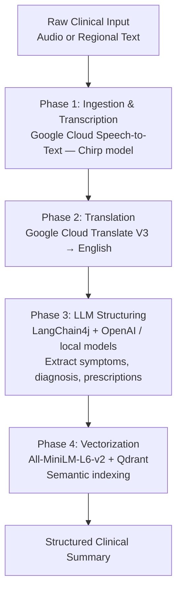

# Java Enterprise — `clinical-intelligence` (Micronaut)

> **Documentation depth note:** this document is built from the monorepo's own top-level README plus general, verified documentation for Micronaut, LangChain4j, and Qdrant's integration patterns. Unlike [`mobile.md`](mobile.md) and [`backend.md`](backend.md), no file- or class-level source material for this service was available at the time of writing — GitHub's `robots.txt` blocks automated browsing of the repository tree, and no architecture review in this repository's history covers this service. Treat class names and line-level detail here as **not available**, not as absent from the real codebase.

---

## Table of Contents

- [Architecture](#architecture)
- [Pipeline](#pipeline)
- [Google Cloud Speech-to-Text](#google-cloud-speech-to-text)
- [Google Cloud Translate](#google-cloud-translate)
- [LangChain4j](#langchain4j)
- [Embeddings](#embeddings)
- [Qdrant](#qdrant)
- [Semantic Search](#semantic-search)
- [Clinical Structuring](#clinical-structuring)
- [Enterprise Deployment](#enterprise-deployment)
- [Future RAG](#future-rag)
- [Relationship to the Rest of the Platform](#relationship-to-the-rest-of-the-platform)

---

## Architecture

`clinical-intelligence` is a **Micronaut** application — a JVM framework chosen (per its own project description) for reactive, high-performance microservices, using Project Reactor for its endpoint layer. It lives inside a Gradle multi-project build alongside a sandbox app and shared libraries:

```
projects/
├── apps/
│   ├── clinical-intelligence/   # This service
│   └── app/                       # Java sandbox app
└── libs/
    ├── utilities/                  # Shared helpers, text processing
    └── list/                        # Shared data structures / domain models
```

Core dependencies, confirmed from the project's own description: **Java 17+**, **Gradle** (Kotlin DSL, `settings.gradle.kts`), **Micronaut**, **LangChain4j**, **Qdrant**, **Google Cloud Speech-to-Text V2 (Chirp)**, and **Google Cloud Translate V3**.

## Pipeline

The service processes raw clinical input — audio or regional-language text — through four sequential phases:



This pipeline processes **doctor consultation notes, medical reports, sleep study results, and audio transcriptions** — a broader artifact set than the mobile app's live-consultation flow, and framed around **regional-language** input specifically, which the mobile/Dart Frog pair does not handle at all.

## Google Cloud Speech-to-Text

Phase 1 uses **Speech-to-Text V2 with the Chirp model**, Google's universal speech model, chosen specifically (per the project's own framing) for **advanced transcription of regional languages** — a capability neither the mobile app's on-device/cloud speech services nor the Dart Frog backend provide. The mobile app's speech pipeline (see [`mobile.md`](mobile.md)) is English-oriented, on-device-first, and consultation-scoped; this is a separate, batch-oriented transcription path.

## Google Cloud Translate

Phase 2 uses **Translate V3** to normalize transcribed regional-language text into English before it reaches the LLM structuring phase. This is a deliberate design choice: it means Phase 3's clinical-structuring prompts only ever need to reason about English text, regardless of the consultation's original language.

## LangChain4j

Phase 3 uses **LangChain4j**, the idiomatic Java library for LLM orchestration (not a Java port of the Python LangChain — an independent, Java-convention-first library with first-class Micronaut integration). It extracts structured clinical fields — symptoms, diagnosis, prescriptions — from the translated transcript, using either OpenAI or local models depending on configuration. An OpenAI API key is a documented prerequisite for running this service.

## Embeddings

Phase 4 begins with **All-MiniLM-L6-v2**, a compact sentence-embedding model, producing 384-dimensional vectors from the structured clinical text — this is the same embedding model LangChain4j's Qdrant integration commonly pairs with `AllMiniLmL6V2EmbeddingModel` out of the box.

## Qdrant

Qdrant is the **persistent vector database** backing semantic search. Standard Qdrant deployment exposes a REST API on port `6333` and a gRPC API on port `6334`; LangChain4j's `QdrantEmbeddingStore` typically talks to the gRPC port. Locally, the project's own setup instructions bring Qdrant up via Docker Compose from within the service's directory:

```bash
cd projects/apps/clinical-intelligence
docker-compose up -d
```

> The exact collection name, vector dimensions, and distance metric configured for this project are not confirmed by available source material — the general LangChain4j + Qdrant pattern configures these via `langchain4j.qdrant.embedding-store.*` properties or a `QdrantEmbeddingStore.builder()` call specifying `collectionName`, `host`, and `port`.

## Semantic Search

The stated purpose of the vectorization phase is to make clinical records **queryable by meaning**, not just by keyword — e.g., finding prior consultations with clinically similar presentations, across the full corpus indexed in Qdrant. No specific query API surface (REST endpoint shapes, filter semantics) is documented in available source material.

## Clinical Structuring

Phase 3's extraction target mirrors, at a conceptual level, the `StructuredSummary` model used by the mobile/Dart Frog pair (complaint, diagnosis, prescriptions) — but the two are **independently defined**. There is no evidence in any available documentation that this service shares a schema, a package, or a runtime dependency with `doctor_app` or `clinical-intelligence-dart`.

## Enterprise Deployment

Documented setup, confirmed from the project's own instructions:

```bash
git clone https://github.com/RADICAL-devp/EdgeLLMHub.git
cd EdgeLLMHub
./gradlew build
./gradlew :clinical-intelligence:run
```

Testing uses **JUnit 5** and **Mockito**:

```bash
./gradlew test                              # all modules
./gradlew :clinical-intelligence:test        # this service only
```

Prerequisites: JDK 17+, Docker & Docker Compose (for local Qdrant), a Google Cloud service account with Speech-to-Text and Translate API access, and an OpenAI API key. No CI/CD pipeline, containerization strategy for the service itself, or cloud deployment target is documented for this service beyond what's covered generically in [`deployment.md`](deployment.md).

## Future RAG

The pipeline's Phase 4 (vectorization + Qdrant) is the substrate for retrieval-augmented generation, but no RAG query flow — retrieving relevant prior records and feeding them back into an LLM call — is documented as implemented today. This is a natural next step given the phases that already exist, consistent with the broader platform's stated caution around RAG: any retrieval grounding for clinical use should draw from a curated, clinically-reviewed corpus (this pipeline's own indexed records), not general web retrieval — see [`architecture.md`](architecture.md#design-decisions) for the same principle as applied to the mobile/Dart Frog pipeline.

## Relationship to the Rest of the Platform

This is the most important open question in the entire documentation set, and it is being stated plainly rather than resolved by assumption:

- No document — architectural review, audit, or implementation walkthrough — covering `doctor_app` or `clinical-intelligence-dart` mentions this service.
- This service's own description does not mention `doctor_app` or `clinical-intelligence-dart`.
- The two backends use different languages, different frameworks, different LLM orchestration approaches, and (per available evidence) different data models for what is conceptually the same "structured clinical summary" concept.

Until this is clarified by the project's maintainers, this documentation set treats `clinical-intelligence` (Java) as an **independently operated system within the same monorepo**, not as a component the mobile app calls or depends on. See [`architecture.md` — Future Architecture](architecture.md#future-architecture) for this listed as an open architectural question.

---

**Next:** [`docs/security.md`](security.md) — the complete security architecture, across all documented systems.