# Data Flow Diagram — Clinical Intelligence Platform (Q5: On-Device Only)

> **Status as of Workstream 9 (Q5 decision).** The production architecture is
> **on-device-first**. All transcription, note editing, and clinical summarization
> runs locally on the clinician's device. The only traffic that leaves the
> device today is the **note sync** to the Dart Frog backend and (dev-only)
> auth token minting. The **cloud LLM path is a working-but-deferred skeleton —
> it is NOT wired into production** (see §5).

---

## 1. Diagram

```mermaid
flowchart LR
    subgraph DEVICE["Clinician Device (on-device — primary path)"]
        MIC["Microphone"]
        STT["STT — speech_to_text plugin<br/>(Speech.framework / RecognizerIntent)<br/>⚑ local, PHI never leaves"]
        EDITOR["Note editor — flutter_quill<br/>(Quill Delta rich text + plain text)"]
        LLM["On-device LLM — MLC runtime<br/>SmolLM-350M-Instruct-q4f16_1-MLC<br/>⚑ local inference"]
        DRIFT[("Local Drift DB<br/>doctor_notes.sqlite<br/>✖ not encrypted at rest (W8)")]
        QUEUE["Sync queue<br/>LWW + backoff + dead-letter<br/>(SyncQueueService)"]
        PREFS["SharedPreferences<br/>cloud_llm_enabled, phi_consent_granted"]
        EXPORT["Diagnostics exporter<br/>(device log incl. consent audit trail)"]
        AUTH["AuthTokenService<br/>JWT cached in memory"]
    end

    subgraph BACKEND["Dart Frog backend — clinical-intelligence-dart"]
        ROUTES["Routes /api/v1/*"]
        JWT["JWT RS256 middleware<br/>(KMS signer in prod)"]
        AUDIT["Audit logger<br/>audit_logs (Drift) + PHI redaction"]
        DB2[("Clinical DB (Drift)<br/>synced_doctor_notes, transcripts,<br/>summary_bundles, processed_outputs")]
        CRYPTO["AES-GCM (ChaCha20-Poly1305)<br/>field-level DEKs, 100k PBKDF2"]
        TOKENEP["POST /api/v1/auth/token"]
    end

    subgraph SKEL["Cloud LLM — SKELETON / DEFERRED (Q5)"]
        CLLM["CloudLlmAdapter<br/>/api/v1/transcript-summary/*<br/>NOT wired in production"]
        STUB["StubLlmAdapter<br/>(offline placeholder)"]
    end

    MIC -->|audio| STT
    STT -->|"transcript (plain text)"| EDITOR
    EDITOR -->|"delta JSON + plain text"| DRIFT
    EDITOR -->|"text for AI assist"| LLM
    LLM -->|"structured summary / doctor note"| EDITOR
    DRIFT -->|"DoctorNote"| QUEUE
    QUEUE -->|"Dio + AuthInterceptor (Bearer JWT)"| ROUTES
    AUTH -->|"POST /api/v1/auth/token"| TOKENEP
    PREFS -->|"consent gate (UI only today)"| LLM
    EDITOR -->|"manual export (user-initiated)"| EXPORT
    ROUTES --> JWT
    JWT --> AUDIT
    AUDIT --> DB2
    JWT -->|"write with AES-GCM field encryption"| DB2
    DB2 --> CRYPTO
    LLM -.->|"fallback tier — gated, disabled in prod"| CLLM
    CLLM -.->|"offline fallback"| STUB
```

---

## 2. Stage-by-stage narrative

### 2.1 Microphone → STT (on-device)
`SpeechServiceFactory.create` (`lib/core/services/speech_service_factory.dart`)
selects a **local** `SpeechService` on physical devices:

- iOS: `IosSpeechService` (Speech.framework)
- Android: `AndroidSpeechService` (RecognizerIntent)
- `LocalSpeechService` (core post-processing: medical abbreviation expansion, BP/HR/RR formatting, temperature normalization)

Microphone permission is requested at runtime. **Audio never leaves the
device.** The only STT exception is `CloudSpeechService`, which is a
**simulator-only mock** that returns canned sample text — no real audio is
transmitted (it is a dev/test path, not production STT).

**PHI boundary:** raw audio = PHI. Stays on device. ✓

### 2.2 Note editor (flutter_quill)
`NoteEditorPage` (`lib/features/note_assist/presentation/pages/note_editor_page.dart`)
holds a `QuillController`. The document Delta is serialized to JSON
(`richTextDelta`) and plain text (`rawText`) and pushed to
`NoteEditorCubit.updateText`, which persists to the local Drift DB and
enqueues a sync entry.

### 2.3 On-device LLM (MLC, SmolLM-350M)
`HybridLlmAdapter` (`lib/core/llm/hybrid_llm_adapter.dart`) is the production
LLM port:

1. **Native tier** — `SmolLLMAdapter` (Android) / `IosNativeLlmAdapter` (iOS):
   MLC runtime via the `com.example.clinical/llm` MethodChannel; streaming
   generation via EventChannel with a 20s timeout. Model:
   `SmolLM-350M-Instruct-q4f16_1-MLC`.
2. **Cloud tier** — `CloudLlmAdapter`: **deferred skeleton (Q5)**. See §5.
3. **Stub tier** — `StubLlmAdapter`: offline placeholder responses so the app
   never hard-fails.

Model artifacts are downloaded once (`ModelManagerCubit.downloadModel`) and
**SHA-256 checksum-verified** before extraction (`_verifyChecksum`,
`lib/features/note_assist/presentation/cubit/model_manager_cubit.dart:545`).

**PHI boundary:** transcript text fed to the LLM stays in-process on the
device. ✓ (Cloud tier is the exception — it would transmit PHI, and it is
disabled in production.)

### 2.4 Local persistence (Drift)
`LocalDatabase` (`lib/features/note_assist/data/local/local_database.dart`,
`doctor_notes.sqlite` in the app documents directory) stores:

- `doctor_notes` — rawText, richTextDelta (Quill Delta JSON), extractedFields, patientRecap
- `transcripts` — raw + cleaned transcript text
- `transcript_summaries` — structured summary / doctor note JSON
- `sync_queue_entries` — pending/dead-letter sync payloads

**⚠ Gap (W8 hardening):** the device SQLite file is **not encrypted at rest**.
No SQLCipher/`crypto` FS integration is present today.

**PHI boundary:** transcripts and notes = PHI, stored locally. ✓ (unencrypted
file — acknowledged risk, see `docs/threat_model.md`).

### 2.5 Sync queue → backend
`SyncQueueService` (`lib/core/services/sync_queue_service.dart`):

- LWW conflict resolution with explicit conflict flag for same-timestamp edits
- Exponential backoff `min(2^n s, 60s)` + jitter, max 5 retries → dead-letter
- Foreground timer (5 min), connectivity-triggered flush, Android workmanager
  background task (15 min)

`NoteSyncRepository.syncNoteToBackend` → `NoteRemoteDatasource` (Dio) with
`AuthInterceptor` (Bearer JWT, single 401-refresh) → Dart Frog routes:

- `POST /api/v1/notes/sync`
- `PUT /api/v1/notes/consultation/[consultationId]`

**What leaves the device:** the full `DoctorNote` (noteId, consultationId,
**patientId, doctorId, rawText, richTextDelta**, extractedFields,
patientRecap) — i.e. **PHI is transmitted during sync**. This is the one
production data path off the device.

**Transport:** `EnvironmentConfig.apiBaseUrl` — `https://` on staging/prod
(TLS ✓); `http://127.0.0.1:8080` in dev only. **⚠ dev is plaintext; no
certificate pinning anywhere (W8).**

### 2.6 Backend (Dart Frog)
`routes/_middleware.dart` composes:

- **JWT auth** — `authMiddleware` (RS256; `KmsSigner` when `AWS_KMS_KEY_ID`
  is set, otherwise a dev keypair; exempts only `api/v1/auth/token`)
- **Audit** — `auditMiddleware` → `AuditLogger` (buffered Drift writes to
  `audit_logs`, PHI-redacted metadata via `PhiRedactor`)
- **Encryption at rest** — `AesGcmService` (ChaCha20-Poly1305 AEAD, per-field
  DEKs via PBKDF2-SHA256 100k iterations, AAD bound); `DriftDoctorNoteRepository`
  encrypts `patientId, doctorId, rawText, richTextDelta, extractedFields,
  patientRecap` before writing `synced_doctor_notes`
- **Drift persistence** — `ClinicalDatabase` (transcripts, summary_bundles,
  processed_outputs, audit_logs, synced_doctor_notes)

**PHI boundary (backend):** PHI stored encrypted at rest; audit logs keep
PHI-free metadata only. TLS required in staging/prod. ⚠ Dev backend has
wide-open CORS `*` and hardcoded dev keys (dev only).

### 2.7 Diagnostics export
`DiagnosticsExporter` (`lib/features/note_assist/domain/services/diagnostics_exporter.dart`)
writes a timestamped log file (app documents dir) that the user shares
manually. It includes environment info, pending/dead-letter entries, and —
since Workstream 9 — a **consent audit trail** of `consent-changed` entries
(see `settings_page.dart:_recordConsentChange`). The export is user-initiated
and the contents are PHI-bearing by design.

---

## 3. What stays on device vs. what goes to the backend

| Data | Location | Leaves device? |
|---|---|---|
| Microphone audio | device (STT) | ❌ never |
| Transcript (raw + cleaned) | local Drift | ⚠ syncs as part of DoctorNote to backend |
| Note rich-text (Quill Delta) | local Drift | ⚠ syncs (encrypted at rest on backend) |
| Structured summary / doctor note | local Drift | ⚠ syncs |
| Patient/doctor identifiers | local Drift | ⚠ syncs (AES-GCM encrypted at rest on backend) |
| LLM model artifact (SmolLM-350M) | device (documents dir) | ❌ downloaded once, then local |
| JWT token | memory only | ❌ minted from backend, never persisted |
| Consent flags | SharedPreferences | ❌ (exported only in user-initiated log) |
| Audit events | backend `audit_logs` | n/a (backend-side, PHI-redacted) |

---

## 4. Encryption annotations

| Path | At rest | In transit |
|---|---|---|
| Device: local Drift DB | **✖ plain SQLite** (W8: SQLCipher) | n/a |
| Device: SharedPreferences consent flags | **✖ plaintext** (W8) | n/a |
| Device: JWT token | n/a — in-memory only | n/a |
| Device → backend (sync + token) | n/a | **TLS** (staging/prod); http in dev only |
| Backend: `synced_doctor_notes` | **✓ AES-GCM (ChaCha20-Poly1305), field-level** | TLS |
| Backend: `audit_logs` | PHI-redacted metadata | TLS |
| Model download (device) | n/a | TLS when URL configured; **SHA-256 checksum-verified** |

---

## 5. Cloud LLM fallback — skeleton / deferred (Q5)

- `CloudLlmAdapter` (`lib/core/llm/cloud_llm_adapter.dart`) is **code-complete**
  against `/api/v1/clinical-processing/process` and `/api/v1/transcript-summary/*`.
- It sits in the `HybridLlmAdapter` fallback chain, gated by
  `EnvironmentConfig.cloudLlmEnabled` (`CLOUD_LLM_ENABLED` compile-time flag;
  defaults to `isDebug`).
- **Known wiring gap (documented, not changed by W9):** `LlmPortFactory`
  (`lib/core/llm/llm_port_factory.dart:68`) reads the **compile-time flag**,
  not the `SharedPreferences` `cloud_llm_enabled` / `phi_consent_granted`
  toggles from the settings page. The consent toggle is therefore **UI-only**
  today. Before any production cloud enablement, the factory must be wired to
  the persisted consent flag — **W8 hardening item**.
- The PHI gate is enforced in the adapter contract: `HybridLlmAdapter`
  skips the cloud tier when `cloudEnabled == false` and disables it
  permanently on `ComplianceException`.

---

## 6. PHI boundaries (summary)

1. **Inside the device:** everything — audio, transcript, notes, summaries,
   LLM inference. This is the Q5 decision in practice: clinical processing is
   on-device.
2. **Leaving the device today:** note sync payloads (PHI, encrypted at rest
   on the backend) and the JWT mint request.
3. **Never leaves in production:** microphone audio, LLM prompts (cloud tier
   disabled), consent flags.
