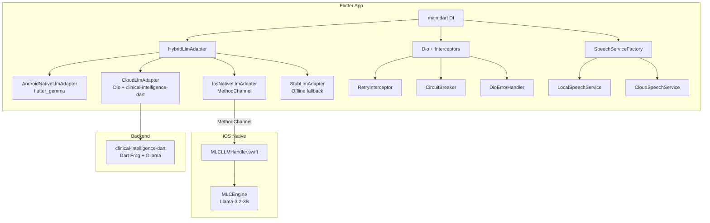

# Doctor App — Implementation Walkthrough

## Summary

All 6 implementation phases are complete. The app now has:
- **Zero compile errors** (0 errors, only pre-existing info/warnings)
- **53 passing unit tests** covering the new infrastructure
- **Fully wired iOS MethodChannel** (fixes `MissingPluginException`)
- **3-tier LLM fallback** (native → cloud → stub) with compliance gating
- **Network resilience** (retry with exponential backoff, circuit breaker)
- **Prompt-injection defense** with false-positive prevention for clinical text

---

## Architecture

---

## Phase 1: Infrastructure & Error Foundation

### Exception Hierarchy
[app_exceptions.dart](file:///Users/devanshparashar/dev-playground/projects/apps/doctor_app/lib/core/exceptions/app_exceptions.dart)

Unified exception tree rooted at `AppException`:

| Exception | Purpose |
|---|---|
| `LlmException` | Base for all LLM failures (tracks provider) |
| `LlmInitializationException` | Model load/init failures |
| `NetworkException` | HTTP failures (tracks `isTransient`, `statusCode`) |
| `CircuitBreakerOpenException` | Circuit breaker tripped |
| `SpeechException` / `SpeechUnavailableException` | Speech recognition failures |
| `DatabaseException` / `DatabaseMigrationException` | Drift DB failures |
| `ValidationException` | Input validation (tracks `ValidationFailureReason`) |
| `ComplianceException` | PHI/compliance violations |
| `UnsupportedPlatformException` | Wrong platform for adapter |

### LLM Adapters

- [stub_llm_adapter.dart](file:///Users/devanshparashar/dev-playground/projects/apps/doctor_app/lib/core/llm/stub_llm_adapter.dart) — Never throws. Returns `[OFFLINE MODE]` prefixed responses. Last-resort fallback.
- [android_native_llm_adapter.dart](file:///Users/devanshparashar/dev-playground/projects/apps/doctor_app/lib/core/llm/android_native_llm_adapter.dart) — Uses `flutter_gemma` (Gemma 2B). Only instantiated on Android.
- [ios_native_llm_adapter.dart](file:///Users/devanshparashar/dev-playground/projects/apps/doctor_app/lib/core/llm/ios_native_llm_adapter.dart) — Uses `MethodChannel('com.example.clinical/llm')` → MLCLLMHandler.swift.
- [hybrid_llm_adapter.dart](file:///Users/devanshparashar/dev-playground/projects/apps/doctor_app/lib/core/llm/hybrid_llm_adapter.dart) — **3-tier fallback** with availability tracking and compliance gating.
- [cloud_llm_adapter.dart](file:///Users/devanshparashar/dev-playground/projects/apps/doctor_app/lib/core/llm/cloud_llm_adapter.dart) — Dio-based, talks to `clinical-intelligence-dart` backend.

### Main DI Overhaul
[main.dart](file:///Users/devanshparashar/dev-playground/projects/apps/doctor_app/lib/main.dart) — Complete rewrite with:
- Environment-aware configuration
- Clean GetIt dependency injection
- First-launch AI risk disclaimer dialog
- Wired interceptors (RetryInterceptor, CircuitBreaker → DioErrorHandler)

---

## Phase 2: iOS MLCSwift Integration

### Key Files
- [MLCLLMHandler.swift](file:///Users/devanshparashar/dev-playground/projects/apps/doctor_app/ios/Runner/MLCLLMHandler.swift) — Native handler for `MethodChannel('com.example.clinical/llm')`. Runtime detection of MLCSwift availability. Handles `isAvailable`, `initialize`, `generate`, `generateStream`.
- [AppDelegate.swift](file:///Users/devanshparashar/dev-playground/projects/apps/doctor_app/ios/Runner/AppDelegate.swift) — Registers MLCLLMHandler against the engine's binary messenger.
- [Podfile](file:///Users/devanshparashar/dev-playground/projects/apps/doctor_app/ios/Podfile) — iOS minimum bumped to 15.0 for Metal GPU support.
- [prepare_model.sh](file:///Users/devanshparashar/dev-playground/projects/apps/doctor_app/ios/scripts/prepare_model.sh) — Build automation: verifies prerequisites (CMake, Git-LFS, Rust, mlc_llm), runs `mlc_llm package`.

> [!IMPORTANT]
> To enable real on-device inference, you must:
> 1. Run `ios/scripts/prepare_model.sh` to compile the model
> 2. Add MLCSwift as a local Swift Package in Xcode
> 3. Build on a **physical A15+ device** (6GB+ RAM)

---

## Phase 3: Speech Service & Cloud Resilience

- [speech_service.dart](file:///Users/devanshparashar/dev-playground/projects/apps/doctor_app/lib/core/services/speech_service.dart) — Abstract interface
- [local_speech_service.dart](file:///Users/devanshparashar/dev-playground/projects/apps/doctor_app/lib/core/services/local_speech_service.dart) — Plugin-based (`speech_to_text`)
- [cloud_speech_service.dart](file:///Users/devanshparashar/dev-playground/projects/apps/doctor_app/lib/core/services/cloud_speech_service.dart) — HTTP STT via Dio
- [speech_service_factory.dart](file:///Users/devanshparashar/dev-playground/projects/apps/doctor_app/lib/core/services/speech_service_factory.dart) — Factory with local→cloud fallback

---

## Phase 4: Error Handling & Resilience

- [dio_error_handler.dart](file:///Users/devanshparashar/dev-playground/projects/apps/doctor_app/lib/core/network/dio_error_handler.dart) — Maps `DioException` → typed `NetworkException` with transience metadata.
- [retry_interceptor.dart](file:///Users/devanshparashar/dev-playground/projects/apps/doctor_app/lib/core/network/retry_interceptor.dart) — Exponential backoff with jitter. Only retries transient errors (5xx, timeouts).
- [circuit_breaker.dart](file:///Users/devanshparashar/dev-playground/projects/apps/doctor_app/lib/core/network/circuit_breaker.dart) — 3-state machine (closed → open → half-open). Threshold: 5 failures. Cooldown: 30s.
- [input_validator.dart](file:///Users/devanshparashar/dev-playground/projects/apps/doctor_app/lib/core/validation/input_validator.dart) — Length limits, charset sanitization, prompt-injection detection with false-positive prevention for clinical text.

---

## Phase 5: State Management & Database Fixes

### Cubit Fixes
- [note_editor_cubit.dart](file:///Users/devanshparashar/dev-playground/projects/apps/doctor_app/lib/features/note_assist/presentation/cubit/note_editor_cubit.dart) — Fixed auto-save race condition with debounce timer cancellation.
- [ai_assist_cubit.dart](file:///Users/devanshparashar/dev-playground/projects/apps/doctor_app/lib/features/note_assist/presentation/cubit/ai_assist_cubit.dart) — Fixed dangling subscription leak with proper `close()` cleanup.
- [model_manager_cubit.dart](file:///Users/devanshparashar/dev-playground/projects/apps/doctor_app/lib/features/note_assist/presentation/cubit/model_manager_cubit.dart) — Real verification logic with timeout + platform error handling. Fixed catch clause ordering.

### Database & Sync
- [local_database.dart](file:///Users/devanshparashar/dev-playground/projects/apps/doctor_app/lib/features/note_assist/data/local/local_database.dart) — Real v1→v2 migration (creates TranscriptSummaries table). Added `beforeOpen` for schema integrity validation.
- [note_sync_repository.dart](file:///Users/devanshparashar/dev-playground/projects/apps/doctor_app/lib/features/note_assist/data/repositories/note_sync_repository.dart) — Typed exceptions, bulk `syncAllPending()`, structured `SyncResult`.
- [note_remote_datasource.dart](file:///Users/devanshparashar/dev-playground/projects/apps/doctor_app/lib/features/note_assist/data/remote/note_remote_datasource.dart) — Uses `DioErrorHandler` instead of bare `Exception`.

---

## Phase 6: Testing & Validation

### Test Results: **53 tests, all passing ✅**

| Test File | Tests | Coverage |
|---|---|---|
| [app_exceptions_test.dart](file:///Users/devanshparashar/dev-playground/projects/apps/doctor_app/test/core/exceptions/app_exceptions_test.dart) | 12 | Inheritance chains, metadata, defaults |
| [stub_llm_adapter_test.dart](file:///Users/devanshparashar/dev-playground/projects/apps/doctor_app/test/core/llm/stub_llm_adapter_test.dart) | 7 | All methods complete, offline prefix, no-throw guarantee |
| [hybrid_llm_adapter_test.dart](file:///Users/devanshparashar/dev-playground/projects/apps/doctor_app/test/core/llm/hybrid_llm_adapter_test.dart) | 10 | 3-tier fallback, availability tracking, compliance gate |
| [circuit_breaker_test.dart](file:///Users/devanshparashar/dev-playground/projects/apps/doctor_app/test/core/network/circuit_breaker_test.dart) | 9 | State machine (closed/open/half-open), threshold, cooldown |
| [input_validator_test.dart](file:///Users/devanshparashar/dev-playground/projects/apps/doctor_app/test/core/validation/input_validator_test.dart) | 13 | Length, charset, injection detection, clinical false-positive prevention |
| (existing migration test) | 2 | Pre-existing |

### Static Analysis: **0 errors**
- 18 total issues: all info/warning level
- 4 warnings in generated code (`local_database.g.dart` — needs `build_runner` regeneration)
- Remaining are style suggestions in pre-existing code

---

## What's Next

1. **Physical Device Test**: Run on an A15+ iPhone with MLCSwift linked to validate on-device inference end-to-end.
2. **Cloud Backend Test**: Point Dio at your `clinical-intelligence-dart` instance and test the cloud fallback path with OAuth.
3. **Regenerate Drift Code**: Run `flutter pub run build_runner build` to clear the 4 `override_on_non_overriding_member` warnings in generated code.
4. **Cubit Unit Tests** (S6-005): The remaining test gap — would cover `NoteEditorCubit` debounce, `AiAssistCubit` subscription cleanup, and `ModelManagerCubit` verification flow.
